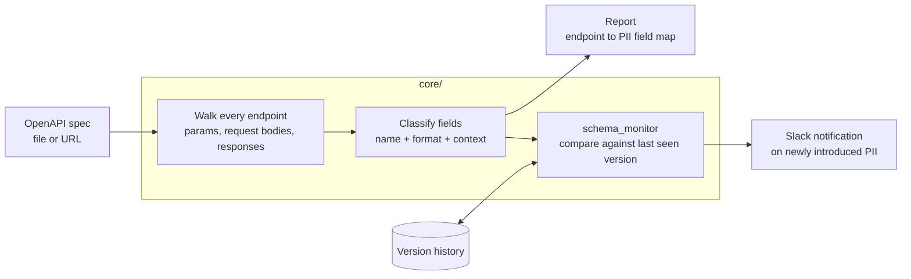

# pii-api-analyzer


Reads an OpenAPI spec, walks every endpoint's parameters, request bodies and
response schemas, and reports where personal data appears. It also watches the
spec over time and tells you when a schema change introduces a new PII field.

The point is that PII exposure is a property of your API contract, and your API
contract is already machine readable. You should not need a manual audit to
answer "which endpoints return an email address".

## How it works



Your API contract is already machine readable, so this needs no traffic capture
and no access to production data.

## What it detects

Field-level classification by name and shape: email addresses, phone numbers,
physical addresses, government identifiers, financial account numbers, dates of
birth, names. Each finding gets a type, a severity, the exact JSON path where it
sits, and a remediation note.

Findings roll up per endpoint into a compliance score, and per API into a
severity breakdown, so you can rank work instead of staring at a flat list.

## Schema change detection

It snapshots the spec, and on each run diffs the current spec against the last
one, so you learn that a response grew a field rather than finding out later.

Be precise about what this mode does and does not do, because the difference
matters: **`scripts/nightly_schema_monitor.py` detects schema changes. It does
not classify them as PII.** It exits non-zero when the spec changed, not when
the change introduced personal data. An earlier version of this README claimed
the monitor blocked a release specifically on a new `government_id` field. It
never did, and no code in this repository ever performed that check.

The gate that does exist is the CLI:

```bash
python main.py --spec openapi.json --fail-on critical
```

That exits 1 when critical personal data is present, which is the check to wire
into CI. Combining the two — diff first, classify the result — is the obvious
next step and is not built yet.

## False positives are the real problem

Any name-based classifier drowns in them. `user_id` is not PII, `device_id` is
not PII, and a naive matcher flags both. The `NON_PII_FIELDS` env var takes a
list of **exact field names** to suppress, and it is the first thing to tune.

Exact, not regex, and deliberately so: matched loosely, a suppression entry of
`id` also matches inside `tax_id`, `passport_id` and `national_id`, so the
configuration meant to remove noise silently hid government identifiers
instead. An analyzer nobody trusts gets ignored, and an ignored analyzer is
worth nothing.

Treat the output as a ranked review queue, not a verdict.

## Setup

```bash
python -m venv venv && source venv/bin/activate
pip install -r requirements.txt
```

That is enough to analyse a spec. There is no database and no network call in
this path:

```bash
python main.py --spec examples/sample-openapi.json
```

The bundled example is synthetic and exercises the cases worth seeing: a
path-level parameter inherited by two operations, personal data behind a `$ref`,
a field whose name says nothing and whose `format: email` says everything, and a
`/health` endpoint that stays clean.

Machine-readable output, and a gate for CI:

```bash
python main.py --spec openapi.json --format json --out findings.json
python main.py --spec openapi.json --fail-on critical   # exit 1 on critical findings
```

### The monitoring mode

Tracking a spec over time needs somewhere to keep the history, so that part
needs Postgres:

```bash
cp .env.example .env      # then edit
python scripts/nightly_schema_monitor.py
```

Dashboards over stored findings:

```bash
python run_pii_dashboard.py          # Streamlit UI
```

## Layout

| Path | Contains |
|---|---|
| `core/` | Parser, detector, schema-change detector, report generator, Slack manager |
| `scripts/` | Batch analysis and the nightly monitor |
| `dashboard/`, `simple_dashboard/` | Streamlit views over stored findings |
| `examples/` | A synthetic OpenAPI spec to run against |
| `demos/` | Runnable examples of each capability |
| `tests/` | Unit tests for the detector, parser and config |
| `jenkins/` | Pipeline definition for scheduled runs |

## A note on what is not in this repository

This tool was originally run against a production API, and its output was a full
map of which endpoints exposed which personal data. **None of those findings are
included here**, and none should ever be committed to a repository, public or
private. A PII exposure report is a target list: it tells a reader exactly which
endpoints leak, where, and which ones are still unfixed.

Point this at your own spec and generate your own findings. `.gitignore` blocks
the report filenames by pattern so a stray `git add -A` cannot publish them.

## What it does not do

- **It reads the contract, not the traffic.** A field that carries personal
  data but is documented as an opaque string will be missed, and a field named
  `email` that never carries one will be flagged. The spec is the input, so the
  quality of the answer follows the quality of the spec.
- **Detection is pattern-based.** Field names, formats and surrounding context
  drive the classification. It is not a model and does not read values, so a
  domain-specific identifier needs adding to the patterns before it is found.
- **PII analysis never samples live responses.** It reads the document, so it
  cannot confirm what an endpoint really returns, and it needs no production
  access to do its job. One part of the repository is different and worth
  knowing about: `src/contract_tester.py` does issue real HTTP requests, and
  the spec fetchers read a spec over HTTP when handed a URL. Those are opt-in
  paths you invoke deliberately, not something the analysis does behind you.
- **Jurisdiction-neutral.** It reports where personal data appears. Whether
  that constitutes special-category data under a given regulation is a legal
  question this tool does not answer.
- **Not a compliance certificate.** Useful as evidence in a review, not as the
  review.

## Contributing

Bug reports and pull requests are welcome. [CONTRIBUTING.md](CONTRIBUTING.md)
covers the setup and the gate that must be green before a PR. Everyone taking
part is expected to follow the [Code of Conduct](CODE_OF_CONDUCT.md).

For a security problem, do not open an issue: see [SECURITY.md](SECURITY.md).

## License

MIT. See [LICENSE](LICENSE).
